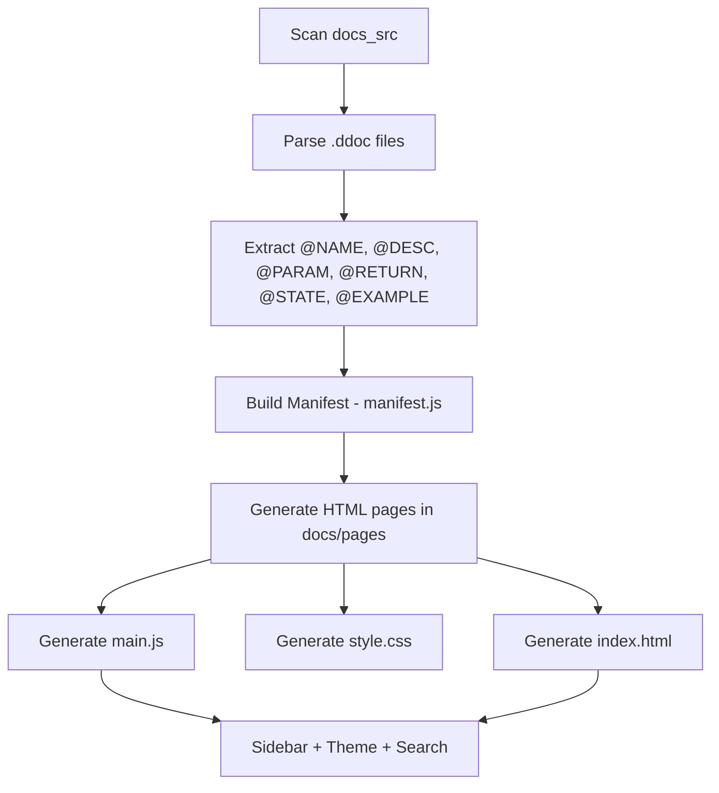
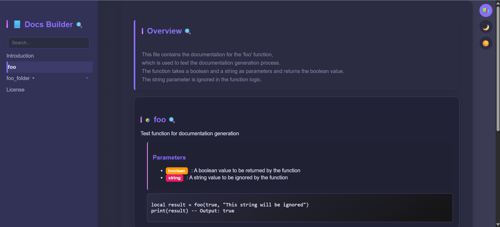
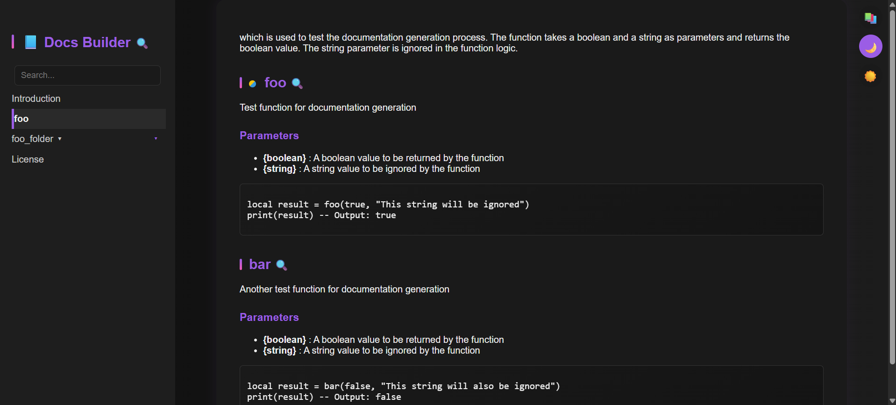
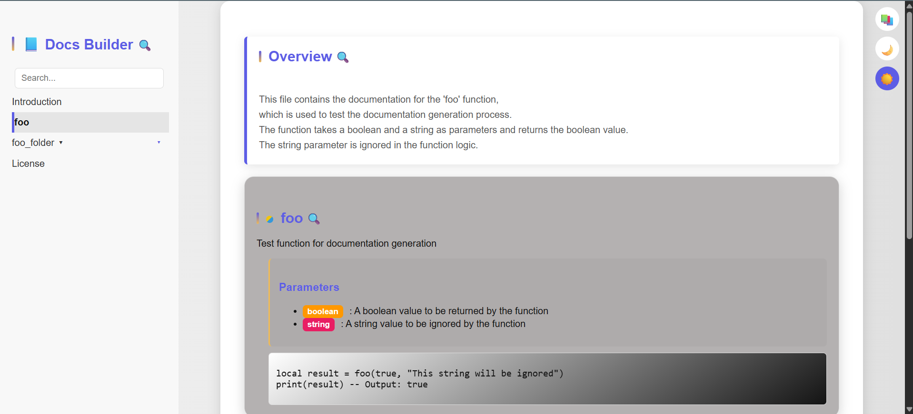

<a id="readme-top"></a>

[![Contributors][contributors-shield]][contributors-url]
[![Forks][forks-shield]][forks-url]
[![Stargazers][stars-shield]][stars-url]
[![Issues][issues-shield]][issues-url]
[![project_license][license-shield]][license-url]
[![Email][email-shield]][email-url]

<br />
<div align="center">
	<a href="https://github.com/Gopmyc/docs_builder">
		
	</a>

<h3 align="center">Documentation Builder</h3>

<p align="center">
	A lightweight static documentation generator written in C.<br/>
	Parse. Structure. Generate. Ship.
	<br />
	<a href="https://github.com/Gopmyc/docs_builder/tree/main/tests">View Demo</a>
	· <a href="https://github.com/Gopmyc/docs_builder/issues/new?labels=bug&template=bug-report---.md">Report Bug</a>
	· <a href="https://github.com/Gopmyc/docs_builder/issues/new?labels=enhancement&template=feature-request---.md">Request Feature</a>
</p>
</div>

---

## 🚀 About The Project

**Documentation Builder** is a static documentation generator written entirely in C.

It scans custom `.ddoc` files, parses structured annotations, builds an internal manifest tree, and generates a fully navigable HTML documentation website — including:

* Dynamic sidebar tree navigation
* Search bar filtering
* Theme switching (default / dark / light)
* YAML-based configuration
* CLIENT / SERVER state rendering (`@STATE` tag)
* Auto-generated manifest system

No frameworks. No runtime dependencies.
Just native C and generated static assets.

> 💡 **Why this project exists:**
> Initially, the author tried using **[Docusaurus](https://docusaurus.io/)** for generating documentation. The official docs were tedious to follow and the dependency tree was overwhelming. Instead of wrestling with heavy tooling, he decided to create a lightweight, zero-dependency static documentation generator tailored for his needs.

---

## ✨ Key Features

* 🔍 Recursive folder scanning of `.ddoc` files  
* 🧠 Structured parsing with custom tags (`@NAME`, `@PARAM`, `@RETURN`, `@STATE`, `@EXAMPLE`)  
* 🌳 Tree-based manifest generation  
* 🎨 Configurable theming via YAML (`docs_config.yaml`)  
* 🌓 Dynamic theme switching (default / dark / light)  
* 🔎 Sidebar search engine  
* 🧩 CLIENT / SERVER state visualization with `@STATE` tag  
* ⚡ Pure static output (HTML/CSS/JS)

<p align="right"><a href="#readme-top">🔝</a></p>

---

## 🏗 Architecture Overview

The project is modular by design:

| Module | Responsibility |
|--------|---------------|
| `parser.c` | Parses `.ddoc` files into structured blocks |
| `scan.c` | Recursively scans directories and generates HTML |
| `manifest.c` | Builds tree structure for navigation |
| `writer.c` | Converts parsed blocks into HTML |
| `yaml.c` | Loads configuration from `docs_config.yaml` |
| `docs_assets.c` | Generates `index.html`, `style.css`, `main.js` |
| `log.c` | Console logging system with color support |

Internal workflow:



---

## 🛠 Built With

*  C (WinAPI for directory scanning and console color)
* Native file I/O
* Custom YAML parser
* Pure JavaScript (no external frameworks)
* CSS custom properties for dynamic themes

<p align="right"><a href="#readme-top">🔝</a></p>

---

## 🧪 Getting Started

### Prerequisites

* Windows (uses WinAPI for scanning and directory handling)
* C compiler (MSVC or MinGW recommended)
* Python (optional, for running a local HTTP server)

### Installation

1. Clone the repository:

```bash
git clone https://github.com/Gopmyc/docs_builder.git
cd docs_builder
```

2. Build the project:

```bash
cl /Fe:docs_builder.exe srcs/*.c
```

or (MinGW):

```bash
gcc srcs/*.c -o docs_builder.exe
```

3. Run the executable:

```bash
docs_builder.exe
```

Make sure `docs_config.yaml` is present at root.

### 4️⃣ Serve Documentation Locally

> ⚠️ To properly view the generated documentation in your browser, you **must** serve it via a local HTTP server. Directly opening `index.html` may break navigation, sidebar, and JavaScript features.

Example using Python:

```bash
cd docs
python -m http.server 8080
```

Then open your browser at: `http://localhost:8080`

---

## 📦 Usage

### 1️⃣ Create `.ddoc` file

Example (`example.ddoc`):

````text
@GLOBAL_DESCRIPTION:
This module handles vector math.

@NAME: AddVectors
@STATE: CLIENT/SERVER
@DESC: Adds two vectors.

@PARAM:
{Vector} : First vector
{Vector} : Second vector

@RETURN:
{Vector} : Result vector

@EXAMPLE:
```lua
local v = AddVectors(a, b)
```
````

> ⚠️ The `@STATE` tag defines the badge color next to the element name:
>
> * `CLIENT` → uses the client color defined in `COLORS_SIDE.CLIENT`
> * `SERVER` → uses the server color defined in `COLORS_SIDE.SERVER`
> * `CLIENT/SERVER` → shows a combined badge for both states

### 2️⃣ Configure `docs_config.yaml`

Example configuration:

```yaml
# PROJET
TITLE:        "Docs Builder"
DESCRIPTION:  "Static Lua documentation generator"
LICENSE_NAME: "MIT License"
LICENSE_URL:  "https://opensource.org/licenses/MIT"

# FILE AND FOLDER CONFIGURATION
INPUT_FOLDER:   "docs_src"
OUTPUT_FOLDER:  "docs"
EXTENSION:      ".html"
ROOT_PATH:      "docs/root"
INDENT_WIDTH:   2
MANIFEST_PATH:  "root/manifest.js"
MAIN_JS_PATH:   "main.js"

# CONSOL COLORS DEFINITIONS
CONSOLE:
  COLOR_RESET:    7
  COLOR_SUCCESS:  10
  COLOR_ERROR:    12
  COLOR_INFO:     11

# THEME ICONS DEFINITIONS
THEME_ICONS:
  DEFAULT:  "📚"
  DARK:     "🌙"
  LIGHT:    "☀️"

# COLORS FOR CLIENT AND SERVER DOCS
COLORS_SIDE:
  CLIENT: "#f1c40f"
  SERVER: "#3498db"

# THEME / COULEURS
THEME:
  BG_MAIN:            "#1F1F2E"
  BG_GRADIENT_START:  "#272739"
  BG_GRADIENT_END:    "#3B3B55"
  BG_PANEL:           "#2B2B42"
  BG_SIDEBAR:         "#323256"
  BG_HOVER:           "#3C3C6B"
  ACCENT:             "#8A6FF7"
  ACCENT_ALT:         "#F38BFF"
  TEXT_MAIN:          "#E6E6FA"
  TEXT_MUTED:         "#B0B0D0"
  TEXT_SUBTLE:        "#8888AA"
  BORDER_SOFT:        "#4A4A70"
  RADIUS_LG:          "16px"
  RADIUS_MD:          "6px"
  TRANSITION_FAST:    "0.2s ease"
  TRANSITION_NORMAL:  "0.3s ease"
```

### 3️⃣ Generate Documentation

Run the executable. Your static site will be generated in the output folder.

---

## 🎨 Visual Preview





---

## 🗺 Roadmap

* [x] Read `.ddoc` files
* [x] Generate HTML from parsed docs
* [x] Tree-based navigation manifest
* [x] YAML configuration injection
* [x] CLIENT / SERVER state differentiation
* [x] Sidebar search engine
* [x] Multiline support in .ddoc documentation documents
* [X] Insert a tab or block to provide clearer visual feedback indicating the parameter's affiliation or usage examples to the parent function.
* [ ] Ability to shout within the tree view depending on the selected state: CLIENT, SERVER, CLIENT/SERVER
* [ ] Syntax highlighting / colored support for .ddoc files in VSCode
* [ ] Documentation versioning system
* [ ] Cross-platform POSIX support

<p align="right"><a href="#readme-top">🔝</a></p>

---

## 🤝 Contributing

Open-source thrives on contribution.

1. Fork the repository
2. Create a feature branch

```bash
git checkout -b feature/MyFeature
```

3. Commit changes

```bash
git commit -m "feat: add MyFeature"
```

4. Push branch

```bash
git push origin feature/MyFeature
```

5. Open a Pull Request

Follow [Conventional Commits](https://www.conventionalcommits.org/en/v1.0.0/).

---

## 🚦 Commit Management

This repository uses **[AutoCommit](https://github.com/Gopmyc/AutoCommit)** to automate commit messages with structured tags and emojis.

Configuration used:

```json
[
	{
    "path":     "srcs/main.c",
		"actions":  {
			"add":     { "tag": "feat",     "emoji": "🚀",  "desc": "add program entry point" },
			"modify":  { "tag": "refactor", "emoji": "♻️",  "desc": "update program flow"     },
			"delete":  { "tag": "refactor", "emoji": "🗑️",  "desc": "remove entry point"      },
			"rename":  { "tag": "refactor", "emoji": "🔁",  "desc": "rename entry module"     },
		}
	},
	{
		"path":     "srcs/parser.c",
		"actions":  {
			"add":     { "tag": "feat",     "emoji": "📖", "desc": "add parsing logic"      },
			"modify":  { "tag": "fix",      "emoji": "🐛", "desc": "fix parsing logic"      },
			"delete":  { "tag": "refactor", "emoji": "♻️", "desc": "remove parsing module"  },
			"rename":  { "tag": "refactor", "emoji": "🔁", "desc": "rename parsing module"  },
		}
	},
	{
		"path":     "srcs/scan.c",
		"actions":  {
			"add":     { "tag": "feat",     "emoji": "🔍", "desc": "add scanning logic"     },
			"modify":  { "tag": "fix",      "emoji": "🐛", "desc": "fix scanning logic"     },
			"delete":  { "tag": "refactor", "emoji": "♻️", "desc": "remove scanning module" },
			"rename":  { "tag": "refactor", "emoji": "🔁", "desc": "rename scanning module" },
		}
	},
	{
		"path":     "srcs/writer.c",
		"actions":  {
			"add":     { "tag": "feat",     "emoji": "📝", "desc": "add writing logic"      },
			"modify":  { "tag": "fix",      "emoji": "🐛", "desc": "fix writing logic"      },
			"delete":  { "tag": "refactor", "emoji": "♻️", "desc": "remove writing module"  },
			"rename":  { "tag": "refactor", "emoji": "🔁", "desc": "rename writing module"  },
		}
	},
	{
		"path":     "srcs/utils.c",
		"actions":  {
			"add":     { "tag": "chore",    "emoji": "🧰", "desc": "add utility functions"    },
			"modify":  { "tag": "refactor", "emoji": "🔧", "desc": "update utility functions" },
			"delete":  { "tag": "refactor", "emoji": "♻️", "desc": "remove utility functions" },
			"rename":  { "tag": "refactor", "emoji": "🔁", "desc": "rename utility module"    },
		}
	},
	{
		"path":     "srcs/log.c",
		"actions":  {
			"add":     { "tag": "feat",     "emoji": "📊", "desc": "add logging system"     },
			"modify":  { "tag": "chore",    "emoji": "🛠️", "desc": "update logging system"  },
			"delete":  { "tag": "refactor", "emoji": "♻️", "desc": "remove logging system"  },
			"rename":  { "tag": "refactor", "emoji": "🔁", "desc": "rename logging module"  },
		}
	},
	{
		"path":     "srcs/docs_assets.c",
		"actions":  {
			"add":     { "tag": "feat",     "emoji": "🚀", "desc": "add index generation"     },
			"modify":  { "tag": "fix",      "emoji": "🐛", "desc": "update index generation"  },
			"delete":  { "tag": "refactor", "emoji": "🗑️", "desc": "remove index generation"  },
			"rename":  { "tag": "refactor", "emoji": "🔁", "desc": "rename index generation"  }
		}
	},
	{
		"path":     "srcs/yaml.c",
		"actions":  {
			"add":     { "tag": "feat",     "emoji": "🚀", "desc": "add yaml parser"    },
			"modify":  { "tag": "fix",      "emoji": "🔧", "desc": "update yaml parser" },
			"delete":  { "tag": "refactor", "emoji": "♻️", "desc": "remove yaml parser" },
			"rename":  { "tag": "refactor", "emoji": "🔁", "desc": "rename yaml parser" }
		}
	},
	{
		"path":     "includes/docs_builder.h",
		"actions":  {
			"add":     { "tag": "feat",     "emoji": "📦", "desc": "add public header"    },
			"modify":  { "tag": "refactor", "emoji": "🔧", "desc": "update public API"    },
			"delete":  { "tag": "refactor", "emoji": "🗑️", "desc": "remove public header" },
			"rename":  { "tag": "refactor", "emoji": "🔁", "desc": "rename public header" },
		}
	},
	{
		"path":     "",
		"actions":  {
			"add":     { "tag": "chore", "emoji": "⚙️", "desc": "add other files"     },
			"modify":  { "tag": "chore", "emoji": "🛠️", "desc": "update other files"  },
			"delete":  { "tag": "chore", "emoji": "🗑️", "desc": "remove other files"  },
			"rename":  { "tag": "chore", "emoji": "🔁", "desc": "rename other files"  },
		}
	}
]
```

> AutoCommit ensures consistent commit messages, making it easy to track features, fixes, refactors, and chores across the codebase with clear emojis and tags.

## 📜 License

Distributed under the MIT License.
See [`LICENSE`](https://github.com/Gopmyc/docs_builder/LICENSE) for details.

---

## 📬 Contact

**Gopmyc**
📧 [gopmyc.pro@gmail.com](mailto:gopmyc.pro@gmail.com)
🔗 [https://github.com/Gopmyc/docs_builder](https://github.com/Gopmyc/docs_builder)

---

## ✅ Credits

* `logo.png` – Portable Document Format icon by [Bharat Icons](https://www.flaticon.com/free-icons/portable-document-format) on Flaticon

---

[contributors-shield]: https://img.shields.io/github/contributors/Gopmyc/docs_builder.svg?style=for-the-badge
[contributors-url]: https://github.com/Gopmyc/docs_builder/graphs/contributors
[forks-shield]: https://img.shields.io/github/forks/Gopmyc/docs_builder.svg?style=for-the-badge
[forks-url]: https://github.com/Gopmyc/docs_builder/network/members
[stars-shield]: https://img.shields.io/github/stars/Gopmyc/docs_builder.svg?style=for-the-badge
[stars-url]: https://github.com/Gopmyc/docs_builder/stargazers
[issues-shield]: https://img.shields.io/github/issues/Gopmyc/docs_builder.svg?style=for-the-badge
[issues-url]: https://github.com/Gopmyc/docs_builder/issues
[license-shield]: https://img.shields.io/github/license/Gopmyc/docs_builder.svg?style=for-the-badge
[license-url]: https://github.com/Gopmyc/docs_builder/blob/main/LICENSE
[email-shield]: https://img.shields.io/badge/email-contact-blue?style=for-the-badge
[email-url]: mailto:gopmyc.pro@gmail.com